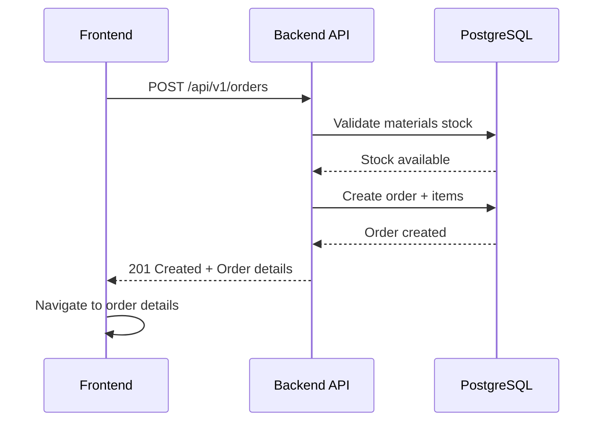
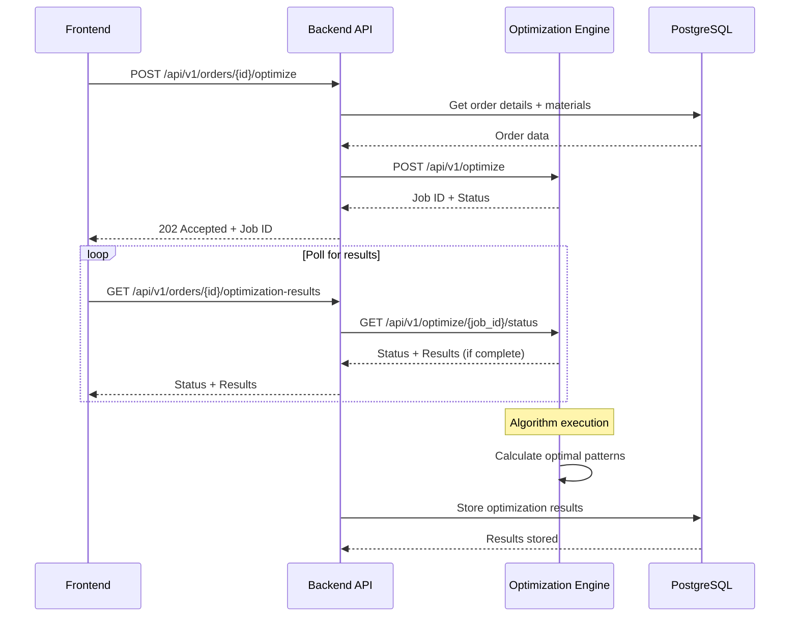
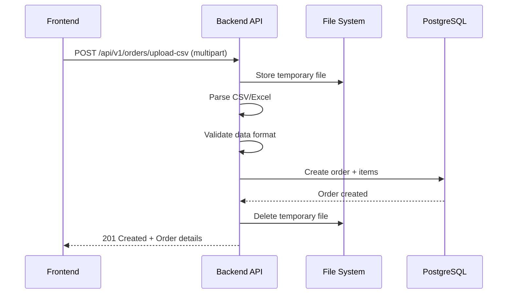

# PLAN DE INTEGRACIÓN - SISTEMA MAXICORTES

## OVERVIEW DE INTEGRACIÓN

Este documento define cómo las **3 aplicaciones** se integran para formar el sistema completo de optimización de corte 2D.

---

## ARQUITECTURA DE COMUNICACIÓN

```
┌─────────────────┐    HTTPS/REST     ┌─────────────────┐    HTTP/JSON     ┌─────────────────┐
│                 │ ◄──────────────── │                 │ ◄──────────────── │                 │
│  Frontend Web   │                   │  Backend API    │                   │ Optimization    │
│   (React)       │ ──────────────► │   (.NET Core)   │ ──────────────► │   Engine        │
│   Port: 3000    │                   │   Port: 5000    │                   │   (Python)      │
└─────────────────┘                   └─────────────────┘                   │   Port: 8000    │
                                              │                             └─────────────────┘
                                              │
                                              ▼
                                      ┌─────────────────┐
                                      │   PostgreSQL    │
                                      │   Port: 5432    │
                                      └─────────────────┘
```

---

## CONTRATOS DE INTEGRACIÓN

### 1. Frontend ↔ Backend API

#### Endpoints Principales:
```typescript
// Materials Management
GET    /api/v1/materials?page=1&size=20&type=wood
POST   /api/v1/materials
PUT    /api/v1/materials/{id}
DELETE /api/v1/materials/{id}

// Orders Management  
GET    /api/v1/orders?status=pending&page=1
POST   /api/v1/orders
GET    /api/v1/orders/{id}
DELETE /api/v1/orders/{id}

// Optimization
POST   /api/v1/orders/{id}/optimize
GET    /api/v1/orders/{id}/optimization-results

// File Upload
POST   /api/v1/orders/upload-csv
POST   /api/v1/orders/upload-excel
```

#### Tipos TypeScript Compartidos:
```typescript
// Material Types
interface Material {
  id: string;
  name: string;
  type: 'wood' | 'metal' | 'glass';
  width: number;
  height: number;
  thickness: number;
  costPerUnit: number;
  stock: number;
  createdAt: string;
}

// Order Types
interface Order {
  id: string;
  orderNumber: string;
  customerId: string;
  status: 'pending' | 'validated' | 'optimized' | 'completed' | 'cancelled';
  items: OrderItem[];
  totalCost: number;
  createdAt: string;
}

interface OrderItem {
  id: string;
  materialId: string;
  geometry: Geometry;
  quantity: number;
  priority: number;
}

// Geometry Types
type Geometry = PolygonGeometry | CircleGeometry | OvalGeometry;

interface PolygonGeometry {
  type: 'polygon';
  coordinates: Point[];
}

interface CircleGeometry {
  type: 'circle';
  center: Point;
  radius: number;
}

interface OvalGeometry {
  type: 'oval';
  center: Point;
  width: number;
  height: number;
}

interface Point {
  x: number;
  y: number;
}

// Optimization Types
interface OptimizationResult {
  id: string;
  orderId: string;
  patterns: CutPattern[];
  metrics: EfficiencyMetrics;
  executionTime: number;
  createdAt: string;
}

interface CutPattern {
  id: string;
  materialId: string;
  placedPieces: PlacedPiece[];
  wasteAreas: WasteArea[];
  utilization: number;
}

interface PlacedPiece {
  pieceId: string;
  position: Point;
  rotation: number;
  geometry: Geometry;
}

interface EfficiencyMetrics {
  totalMaterialUsed: number;
  totalWaste: number;
  utilizationPercentage: number;
  totalCost: number;
  wasteCost: number;
  savings: number;
}
```

### 2. Backend API ↔ Optimization Engine

#### Optimization Request:
```json
POST /api/v1/optimize
{
  "materials": [
    {
      "id": "mat-001",
      "width": 2440,
      "height": 1220,
      "thickness": 18,
      "cost_per_unit": 45.50
    }
  ],
  "pieces": [
    {
      "id": "piece-001",
      "material_id": "mat-001",
      "geometry": {
        "type": "polygon",
        "coordinates": [[0,0], [100,0], [100,50], [0,50]]
      },
      "quantity": 5,
      "priority": 1,
      "rotation_allowed": true
    }
  ],
  "parameters": {
    "algorithm": "genetic",
    "max_execution_time": 120,
    "tolerance": 2.0,
    "kerf_width": 3.0
  }
}
```

#### Optimization Response:
```json
{
  "job_id": "opt-12345",
  "status": "completed",
  "patterns": [
    {
      "material_id": "mat-001",
      "placed_pieces": [
        {
          "piece_id": "piece-001",
          "position": {"x": 10, "y": 10},
          "rotation": 0,
          "geometry": {
            "type": "polygon", 
            "coordinates": [[10,10], [110,10], [110,60], [10,60]]
          }
        }
      ],
      "waste_areas": [
        {
          "geometry": {
            "type": "polygon",
            "coordinates": [[120,10], [2440,10], [2440,1220], [120,1220]]
          },
          "area": 2831600
        }
      ],
      "utilization": 0.85
    }
  ],
  "metrics": {
    "total_material_used": 2975600,
    "total_waste": 144000,
    "utilization_percentage": 85.2,
    "total_cost": 45.50,
    "waste_cost": 2.20,
    "savings": 8.50
  },
  "execution_time": 45.2
}
```

---

## FLUJOS DE INTEGRACIÓN

### 1. Flujo de Creación de Orden



### 2. Flujo de Optimización



### 3. Flujo de Upload de Archivos



---

## CONFIGURACIÓN DE DESARROLLO

### Docker Compose para Desarrollo:
```yaml
version: '3.8'

services:
  # Database
  postgres:
    image: postgres:15
    environment:
      POSTGRES_DB: maxicortes
      POSTGRES_USER: maxicortes
      POSTGRES_PASSWORD: maxicortes123
    ports:
      - "5432:5432"
    volumes:
      - postgres_data:/var/lib/postgresql/data

  # Redis Cache
  redis:
    image: redis:7-alpine
    ports:
      - "6379:6379"

  # Backend API
  backend-api:
    build: ./backend-api
    ports:
      - "5000:5000"
    environment:
      - ConnectionStrings__DefaultConnection=Host=postgres;Database=maxicortes;Username=maxicortes;Password=maxicortes123
      - Redis__ConnectionString=redis:6379
      - OptimizationEngine__BaseUrl=http://optimization-engine:8000
    depends_on:
      - postgres
      - redis
      - optimization-engine

  # Optimization Engine
  optimization-engine:
    build: ./optimization-engine
    ports:
      - "8000:8000"
    environment:
      - REDIS_URL=redis://redis:6379
    depends_on:
      - redis

  # Frontend Web
  frontend-web:
    build: ./frontend-web
    ports:
      - "3000:3000"
    environment:
      - VITE_API_BASE_URL=http://localhost:5000/api/v1
    depends_on:
      - backend-api

volumes:
  postgres_data:
```

### Scripts de Desarrollo:
```bash
# Levantar todo el stack
docker-compose up -d

# Desarrollo individual
cd backend-api && dotnet run
cd optimization-engine && python -m uvicorn main:app --reload
cd frontend-web && npm run dev

# Tests
cd backend-api && dotnet test
cd optimization-engine && pytest
cd frontend-web && npm test

# Linting
cd backend-api && dotnet format
cd optimization-engine && flake8 check . && black .
cd frontend-web && npm run lint
```

---

## MANEJO DE ERRORES ENTRE SERVICIOS

### 1. Backend API → Optimization Engine

```csharp
// Backend: Resilience patterns
public class OptimizationEngineClient
{
    private readonly HttpClient _httpClient;
    private readonly IAsyncPolicy<HttpResponseMessage> _retryPolicy;

    public OptimizationEngineClient(HttpClient httpClient)
    {
        _httpClient = httpClient;
        _retryPolicy = Policy
            .HandleResult<HttpResponseMessage>(r => !r.IsSuccessStatusCode)
            .WaitAndRetryAsync(
                retryCount: 3,
                sleepDurationProvider: retryAttempt => TimeSpan.FromSeconds(Math.Pow(2, retryAttempt)),
                onRetry: (outcome, timespan, retryCount, context) =>
                {
                    // Log retry attempt
                });
    }

    public async Task<OptimizationResult> OptimizeAsync(OptimizationRequest request)
    {
        try
        {
            var response = await _retryPolicy.ExecuteAsync(async () =>
            {
                return await _httpClient.PostAsJsonAsync("/api/v1/optimize", request);
            });

            if (response.IsSuccessStatusCode)
            {
                return await response.Content.ReadFromJsonAsync<OptimizationResult>();
            }
            
            throw new OptimizationServiceException($"Optimization failed: {response.StatusCode}");
        }
        catch (TaskCanceledException)
        {
            throw new OptimizationTimeoutException("Optimization service timeout");
        }
        catch (HttpRequestException ex)
        {
            throw new OptimizationServiceException($"Network error: {ex.Message}");
        }
    }
}
```

### 2. Frontend → Backend API

```typescript
// Frontend: Error handling with React Query
export const useOptimizeOrder = () => {
  return useMutation({
    mutationFn: async (orderId: string) => {
      const response = await apiClient.post(`/orders/${orderId}/optimize`);
      return response.data;
    },
    onError: (error: ApiError) => {
      // Handle different error types
      switch (error.status) {
        case 400:
          toast.error('Invalid order data');
          break;
        case 409:
          toast.error('Order cannot be optimized in current state');
          break;
        case 503:
          toast.error('Optimization service temporarily unavailable');
          break;
        default:
          toast.error('Optimization failed. Please try again.');
      }
    },
    onSuccess: (data) => {
      toast.success('Optimization started successfully');
      // Start polling for results
    }
  });
};
```

---

## TESTING DE INTEGRACIÓN

### 1. Contract Testing
```csharp
// Backend: Pact consumer test
[Test]
public async Task GetOptimizationResult_ShouldReturnValidResult()
{
    // Arrange
    var pact = Pact.V2("Backend API", "Optimization Engine", new PactConfig());
    
    pact.UponReceiving("A request for optimization")
        .Given("optimization job exists")
        .WithRequest(HttpMethod.Post, "/api/v1/optimize")
        .WithHeader("Content-Type", "application/json")
        .WithJsonBody(new { /* request body */ })
        .WillRespondWith()
        .WithStatus(200)
        .WithHeader("Content-Type", "application/json")
        .WithJsonBody(new { /* expected response */ });

    // Act & Assert
    await pact.VerifyAsync(async ctx =>
    {
        var client = new OptimizationEngineClient(ctx.MockServerUri);
        var result = await client.OptimizeAsync(request);
        Assert.That(result, Is.Not.Null);
    });
}
```

### 2. E2E Testing
```typescript
// Frontend: Playwright E2E test
test('complete order optimization flow', async ({ page }) => {
  // Navigate to create order
  await page.goto('/orders/create');
  
  // Fill order form
  await page.fill('[data-testid=customer-name]', 'Test Customer');
  await page.selectOption('[data-testid=material-select]', 'wood-001');
  
  // Add pieces
  await page.click('[data-testid=add-piece]');
  await page.fill('[data-testid=piece-width]', '100');
  await page.fill('[data-testid=piece-height]', '50');
  
  // Submit order
  await page.click('[data-testid=submit-order]');
  
  // Wait for order creation
  await expect(page.locator('[data-testid=order-created]')).toBeVisible();
  
  // Start optimization
  await page.click('[data-testid=optimize-button]');
  
  // Wait for optimization completion
  await expect(page.locator('[data-testid=optimization-complete]')).toBeVisible({ timeout: 60000 });
  
  // Verify results are displayed
  await expect(page.locator('[data-testid=cut-pattern]')).toBeVisible();
  await expect(page.locator('[data-testid=efficiency-metrics]')).toBeVisible();
});
```

---

## MONITOREO Y OBSERVABILIDAD

### 1. Distributed Tracing
```csharp
// Backend: OpenTelemetry setup
services.AddOpenTelemetry()
    .WithTracing(builder =>
    {
        builder
            .AddAspNetCoreInstrumentation()
            .AddHttpClientInstrumentation()
            .AddEntityFrameworkCoreInstrumentation()
            .AddJaegerExporter();
    });
```

### 2. Health Checks
```csharp
// Backend: Health checks
services.AddHealthChecks()
    .AddDbContext<ApplicationDbContext>()
    .AddUrlGroup(new Uri("http://optimization-engine:8000/health"), "optimization-engine")
    .AddRedis(connectionString);
```

### 3. Metrics Collection
```python
# Optimization Engine: Prometheus metrics
from prometheus_client import Counter, Histogram, generate_latest

optimization_requests = Counter('optimization_requests_total', 'Total optimization requests')
optimization_duration = Histogram('optimization_duration_seconds', 'Optimization execution time')

@app.post("/api/v1/optimize")
async def optimize(request: OptimizationRequest):
    optimization_requests.inc()
    
    with optimization_duration.time():
        result = await optimization_service.optimize(request)
    
    return result
```

---

## DEPLOYMENT Y ORQUESTACIÓN

### Kubernetes Deployment:
```yaml
# k8s/namespace.yaml
apiVersion: v1
kind: Namespace
metadata:
  name: maxicortes

---
# k8s/backend-api.yaml
apiVersion: apps/v1
kind: Deployment
metadata:
  name: backend-api
  namespace: maxicortes
spec:
  replicas: 2
  selector:
    matchLabels:
      app: backend-api
  template:
    metadata:
      labels:
        app: backend-api
    spec:
      containers:
      - name: backend-api
        image: maxicortes/backend-api:latest
        ports:
        - containerPort: 5000
        env:
        - name: ConnectionStrings__DefaultConnection
          valueFrom:
            secretKeyRef:
              name: db-secret
              key: connection-string
        - name: OptimizationEngine__BaseUrl
          value: "http://optimization-engine:8000"

---
# k8s/optimization-engine.yaml
apiVersion: apps/v1
kind: Deployment
metadata:
  name: optimization-engine
  namespace: maxicortes
spec:
  replicas: 1
  selector:
    matchLabels:
      app: optimization-engine
  template:
    metadata:
      labels:
        app: optimization-engine
    spec:
      containers:
      - name: optimization-engine
        image: maxicortes/optimization-engine:latest
        ports:
        - containerPort: 8000
        resources:
          requests:
            memory: "1Gi"
            cpu: "500m"
          limits:
            memory: "2Gi"
            cpu: "1000m"
```

---

## CHECKLIST DE INTEGRACIÓN

### Pre-Development:
- [ ] Contratos de API definidos y acordados
- [ ] Tipos TypeScript generados desde OpenAPI
- [ ] Docker compose configurado para desarrollo
- [ ] Base de datos compartida configurada

### Durante Development:
- [ ] Contract tests implementados
- [ ] Mocks configurados para desarrollo independiente
- [ ] Health checks implementados en todos los servicios
- [ ] Error handling consistente entre servicios

### Pre-Production:
- [ ] E2E tests pasando
- [ ] Performance testing completado
- [ ] Security testing realizado
- [ ] Monitoring y alertas configurados

### Production:
- [ ] Deployment pipeline automatizado
- [ ] Rollback procedures documentados
- [ ] Incident response plan definido
- [ ] Documentation actualizada

Este plan de integración asegura que las tres aplicaciones trabajen cohesivamente como un sistema unificado, manteniendo la independencia de desarrollo mientras garantiza la interoperabilidad.